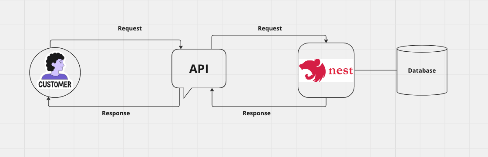

# 1Day-1Project

## BackEnd - 심재두

### 아키텍쳐 구조
 
 
## #프로젝트 소개
- 한 유저가 서비스를 이용하기위해 발급해주는 인증코드를 관리자가 생성 및 관리

## Rest API
| Content | Method | Path    |
|---------|--------|---------|
| 인증코드 생성 | `GET`  | /admins |
| 인증코드 검증 | `POST` | /admins |

### 사용기술

- TypeScript
- NestJs
- Prisma
- PostgreSQL
- Docker


### Server Use

```bash
npm run start:dev
```

### Install
```angular2html
npm i | npm install
```

### Docker PostgreServer Port
```angular2html
5432:5432
```